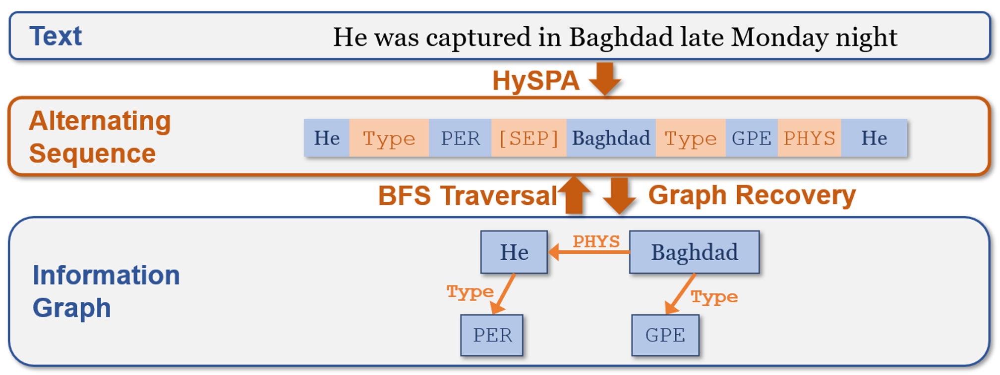

# HySPA: Hybrid Span Generation for Scalable Text-to-Graph Extraction

This is the PyTorch implementation of the paper:
**HySPA: Hybrid Span Generation for Scalable Text-to-Graph Extraction**. Liliang Ren, Chenkai Sun, Heng Ji, Julia Hockenmaier. ***ACL 2021 Findings***
[[PDF]](https://arxiv.org/pdf/2106.15838.pdf) [[Poster]](https://drive.google.com/file/d/1L-zLdTM5EQqDAtgyjrGQWlrDx9qxnTWz/view?usp=sharing) [[Slides]](https://drive.google.com/file/d/1UjIpHx5rMXKgU5O65iHJoX0Od-LmGUcL/view?usp=sharing)

Our implementation is based on the Facebook's [fairseq](https://github.com/pytorch/fairseq) toolkit.

## Overview
<p align="center">

</p>
In this work, we propose a Hybrid Span Generator (HySPA) that invertibly maps the information graph to an alternating sequence of nodes and edge types, and directly generates such sequences via a hybrid span decoder which can decode both the spans and the types recurrently in linear time and space complexities. Extensive experiments on the ACE05 dataset show that our approach also significantly outperforms state-of-the-art on the joint entity and relation extraction task.


## Requirements and Installation

For reproducibility, a cuda version of 10.2 is needed. The required environment can be installed and activated with the following command lines:
```
conda env create -f environment.yml
conda activate hyspa
```
The fairseq toolkit can be then installed with the command lines:
```
cd HySPA
pip install --editable ./

# on MacOS:
# CFLAGS="-stdlib=libc++" pip install --editable ./
```
NVIDIA's [apex](https://github.com/NVIDIA/apex) library is also needed:
```
git clone https://github.com/NVIDIA/apex
cd apex
pip install -v --no-cache-dir --global-option="--cpp_ext" --global-option="--cuda_ext" \
  --global-option="--deprecated_fused_adam" --global-option="--xentropy" \
    --global-option="--fast_multihead_attn" ./
```

## Data preprocessing

First follow the [ACE05 data preprocessing pipeline](https://github.com/dwadden/dygiepp#ace05-ace-for-entities-and-relations) of Dygie++ and then copy the json files of the preprocessed data from the `processed-data` directory (NOT the `collated-data` directory) under the Dygie++ repository to our directory `HySPA/data-bin/ace05/`. Then preprocess the data:
```
cd fairseq/data
python ace_dataset.py 
cd ../..
```


## Training

```
bash run_seqie_acehsd.sh
```
The trained model will be stored in the directory `save/HSDtransformer_ace`, and the tensorboard log files are stored in the directory `tb/`.


## Generation and Evaluation

```
bash run_gen.sh
```

In the `run_gen.sh` script, we first generate the alternating sequence with the fairseq sequence generation pipeline, and then use the `evaluate.py` script to convert the alteranating sequences back to graphs and evaluate the results on the ACE05 test set.


## Citation

```
@inproceedings{ren-etal-2021-hyspa,
    title = "{H}y{SPA}: Hybrid Span Generation for Scalable Text-to-Graph Extraction",
    author = "Ren, Liliang  and 
      Sun, Chenkai  and
      Ji, Heng  and
      Hockenmaier, Julia",
    booktitle = "Findings of the Association for Computational Linguistics: ACL-IJCNLP 2021",
    month = aug,
    year = "2021",
    address = "Online",
    publisher = "Association for Computational Linguistics",
    url = "https://aclanthology.org/2021.findings-acl.356",
    doi = "10.18653/v1/2021.findings-acl.356",
    pages = "4066--4078",
}
```


